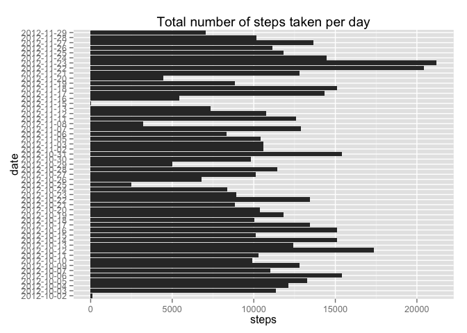
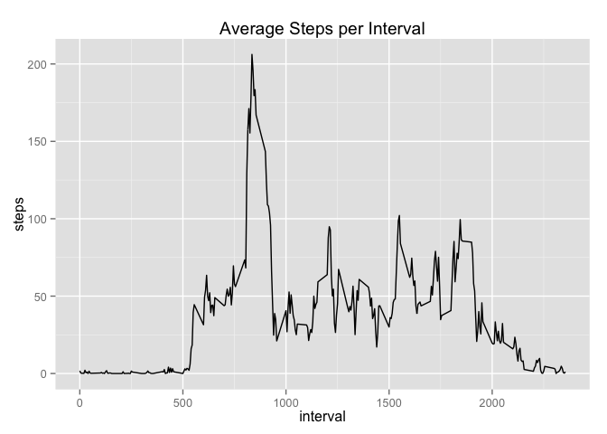
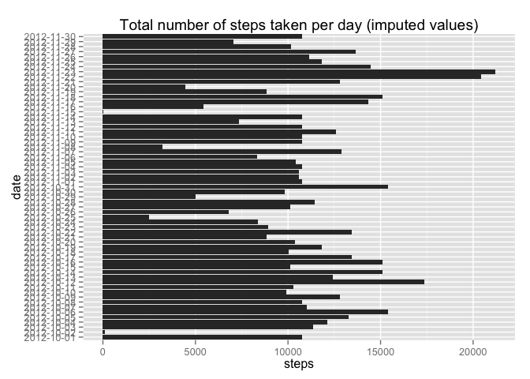
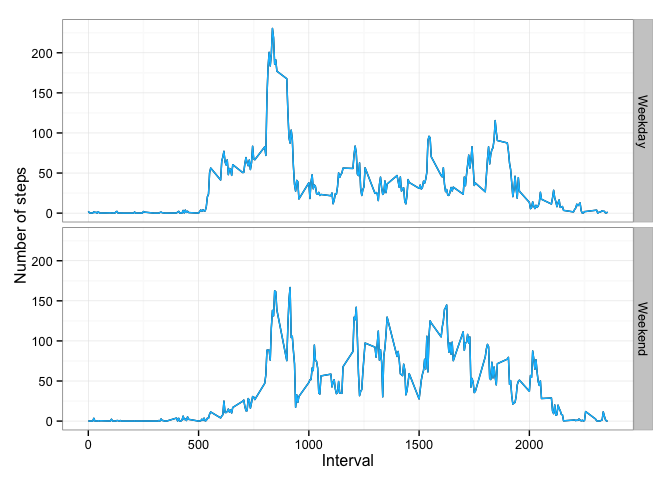

# Reproducible Research: Peer Assessment 1

## Loading and preprocessing the data


```r
library(ggplot2)
library(dplyr)
```

```
## 
## Attaching package: 'dplyr'
## 
## The following object is masked from 'package:stats':
## 
##     filter
## 
## The following objects are masked from 'package:base':
## 
##     intersect, setdiff, setequal, union
```

```r
df <- read.csv("./activity.csv")
df.clean <- df[complete.cases(df), ] # remove missing values
```

## What is mean total number of steps taken per day?


```r
total.steps <- aggregate(steps ~ date, data=df.clean, sum)
total.barplot <- qplot(x=date, y=steps, data=total.steps,
                       geom="bar", stat="identity", position="dodge") +
                labs(title="Total number of steps taken per day")
print(total.barplot + coord_flip())
```

 

- The mean number of steps taken per day is 10766.2.  

- The median number of steps taken per day is 10765.

## What is the average daily activity pattern?


```r
avg.interval.steps <- aggregate(steps ~ interval, data=df.clean, mean)
avg.interval.steps.plot <- qplot(x=interval, y=steps, data=avg.interval.steps,
                                 geom="line") +
                                labs(title="Average Steps per Interval")
print(avg.interval.steps.plot)
```

 

- The 5-min interval with the maximum number of steps, averaged across all days
is 835 
with 206.2 steps.

## Imputing missing values

- The number of missing values in the dataset is 2304

- Missing values are imputed with the mean # of steps for the corresponding 5-min interval 


```r
df.na <- df[which(!complete.cases(df)),]  # rows with missing values
# replace NA with average of steps for interval
df.na.filled <- merge(df.na, avg.interval.steps, by="interval")   
df.na.filled <- df.na.filled[,c("interval", "date", "steps.y")]
names(df.na.filled)[3] <- "steps"
df.imp <- rbind(df.clean, df.na.filled)
df.imp <- arrange(df.imp, date)
# recalculate total number of steps with imputed values and plot
total.steps <- aggregate(steps ~ date, data=df.imp, sum)
total.barplot <- qplot(x=date, y=steps, data=total.steps,
                       geom="bar", stat="identity", position="dodge") +
                labs(title="Total number of steps taken per day (imputed values)")
print(total.barplot + coord_flip())
```

 

- The mean number of steps taken per day is 10766.2.  

- The median number of steps taken per day is 10766.2.

- With imputed values, the mean remained the same, but median increased.

## Are there differences in activity patterns between weekdays and weekends?


```r
df.imp$date <- as.Date(df.imp$date)
df.imp$wend <- as.factor(ifelse(weekdays( df.imp$date) %in% c("Saturday","Sunday"), "Weekend", "Weekday")) 
# summarise the data
df.imp.summ <- 
        df.imp %>% 
        select(wend, interval, steps) %>% 
        group_by(wend, interval) %>%
        summarise(steps=mean(steps))       
# create the plot
g<-qplot(x=interval, y=steps, data=df.imp.summ, geom="line", facets=wend~.)
p<-g + geom_line(color="deepskyblue1") + 
        theme_bw() +
        labs(x="Interval", y="Number of steps")
print(p)
```

 
